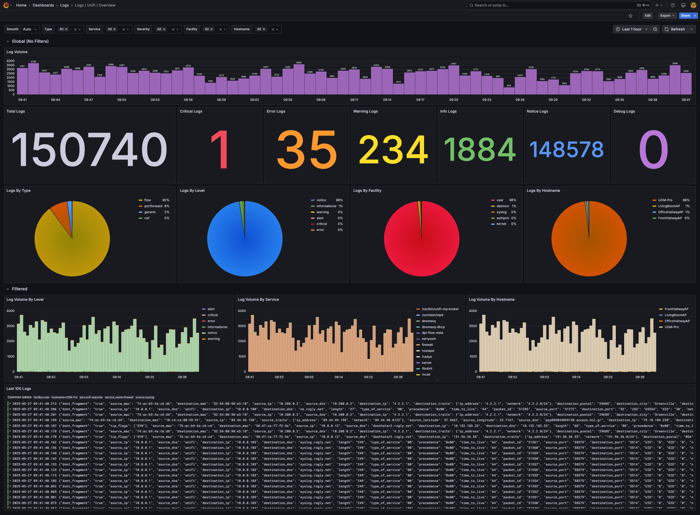
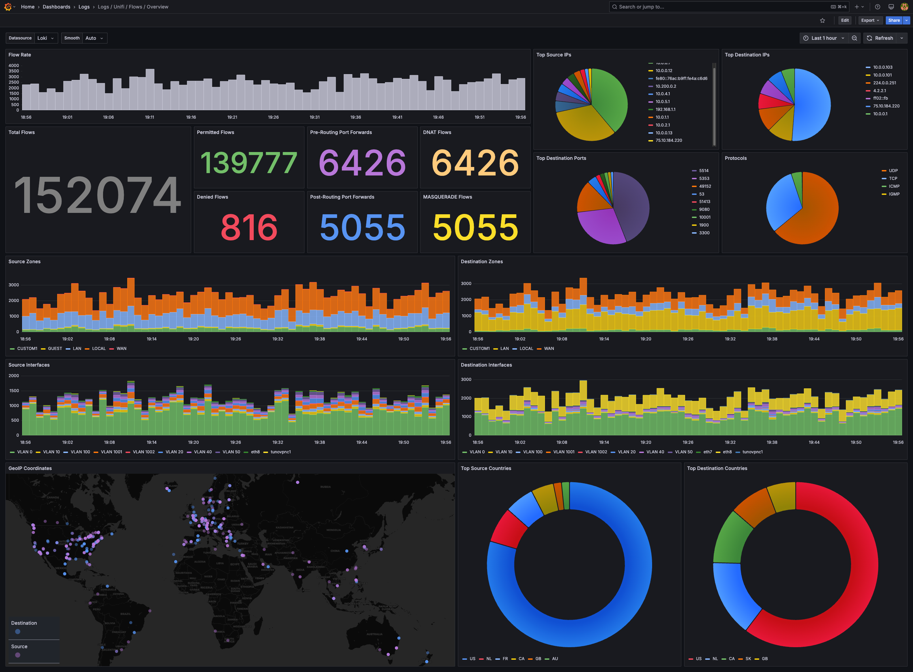
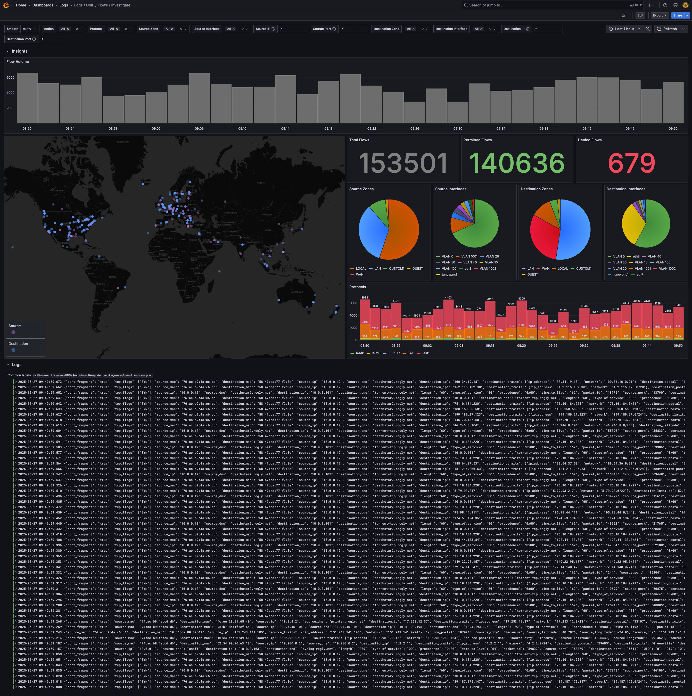

# UniFi Exporter
A Python based Docker container that parses and enriches Syslog messages recieved from a UniFi Controller and exports them to a Loki endpoint.

# Features
 - Network and Control Plane Syslog Parsing
 - Modular Mapping Configurations
 - Automatic GeoIP Database Updates
 - CEF and Syslog Parsing (Since Ubiquiti can't pick one 😋)
 - Grafana Dashboards (🚨 May require updates if modifying Config Maps)
 - Reverse-DNS Lookups for source and destinations IP Addresses (creates `source_dns` and `destination_dns` JSON records)
 - GeoIP Lookups for source and destination IP Addresses
 - Normalized Severity and Facility Labels
 - Service Names (for non-flow logs)
 - PortForward Rule Mapping (requires configuration)
 - IP Protocol Mapping (e.g. 1 = ICMP)
 - Human-Readable Flow Log Fields (e.g. TOS = type_of_service)
 - Source and Destination MAC Address Parsing
 - VLAN Mapping from Bridge Interface (e.g. br10 = VLAN 10)
 - Source and Destiantion Zone Mapping
 - Flow Action Mapping
 - Hostname Normalization (sometimues Ubiquiti includes dashes, sometimes they don't 🙃)

# Requirements
- MaxMind GeoLite Account: [Sign Up](https://www.maxmind.com/en/geolite2/signup?utm_source=kb&utm_medium=kb-link&utm_campaign=kb-create-account)


# Environment Variables
| VARIABLE          | DESCRIPTION           | VALUES                                                           | DEFAULT          | REQUIRED |
|-------------------|-----------------------|------------------------------------------------------------------|------------------|:--------:|
| GEOIP_ACCOUNT_ID  | MaxMind Account ID    | String                                                           | None             | ⚠️       |
| GEOIP_LICENSE_KEY | MaxMind License Key   | String                                                           | None             | ⚠️       |
| TZ                | Timezone              | TZ Database Time Zone                                            | UTC              | ❌       |
| LOG_LEVEL         | Loging Level          | debug, informational, warning, error, critical                   | informational    | ❌       |
| LOKI_URL          | Loki Endpoint URL     | http(s)://domain.tld:port                                        | http://loki:3100 | ❌       |

⚠️: If not provided, GeoIP Enrichment will be `disabled`

# Configuration Maps
Configuration Maps stored in `/app/config` directory of the container:
1. `cef_fields.json`
    - Mapping of order of fields in a CEF message delimited by `|`
2. `cef_severity.json`
    - Maps CEF Severity to Syslog Severity for normalization
3. `facilities.json`
    - Mapping of numerical facilities to human-readable values
4. `flow_fields.json`
    - Mapping of Keys to human-readable values used in Flow Logs Key,Value Pairs
5. `flow_label_fields.list`
    - List of fields from Flow Logs to include as Loki Labels
    - **Note: too many unique label values will cause issues with Loki indexing**
6. `ip_protocols.json`
    - Mapping of numerical IP Protocols to human-readable names
8. `portforward_rules.json`
    - Mapping of shortened Port Forward Rule Names to full names for dashboarding
    - **Note: UniFi Truncates long rule names, so the firs 3 or so charactars is recommended**
9. `syslog_severity.json`
    - Mapping of numerical Syslog Severity to a human readable format
10. `tcp_flags.list`
    - List of TCP Flags to search for in a Flow Log to later append to a list of flags in a single flow

# Quick Start
1. Launch the Docker Container
```bash
docker run -d \
  --name unifi-exporter \
  -e LOG_LEVEL=informational \                      # Log Level for Console
  -e TZ=America/Chicago \                           # Timezone for Time Stamps
  -e LOKI_URL=http://loki.docker.local:3100 \       # Loki Endpoint to Send Logs
  -e GEOIP_ACCOUNT_ID=1234567 \                     # MaxMind Account ID
  -e GEOIP_LICENSE_KEY=abcd1234 \                   # MaxMind License Key
  -p 5514:5514/udp \                                # Port Mapping
  -v /path/to/local/database:/app/database \        # Persistent Storage for Database (Recommended to prevent hitting MaxMind API Limits)
  -v /path/to/local/config:/app/config \            # Persistent Storage for Config Maps (Required if modifying)
  ghcr.io/rogly-net/unifi-exporter:latest
```
2. Configure UniFi Network Logs
    - Settings > CyberSecure > Traffic Logging > Activity Logging > SIEM Server
        - Set the IP and Port to the Container
3. (Optional) Configure Control Plane Logs
    - Settings > Control Plane > Integrations > Activity Logging > SIEM Server
        - Set the IP and Port to the Container

# Grafana Dashboards
1. **Overview:** `dashboards/logs-unifi-overview.json`


2. **Flows Overview:** `dashboards/logs-unifi-flows-overview.json`


3. **Flows Investigate:** `dashboards/logs-unifi-flows-investigate.json`
